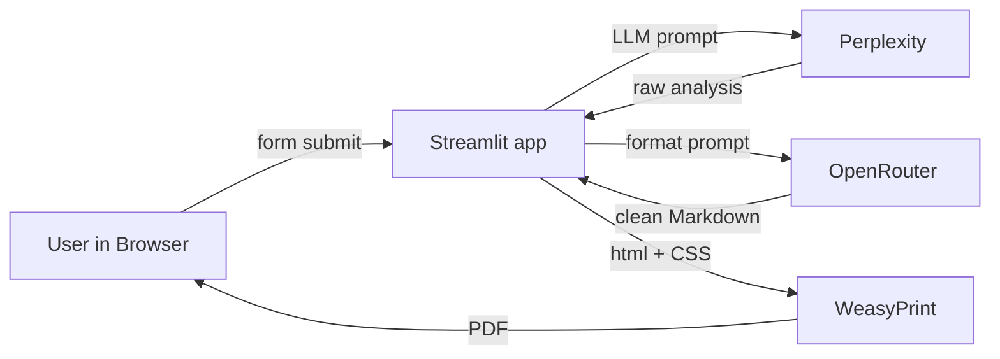

# B2B Customer Intelligence Agent

> **One‑click strategic customer & product analyses powered by GenAI**


## ✨ What does it do?

- **Generates two analysis types** in seconds:
  1. **Firmenanalyse** – strategic company profile (business model, market outlook, competitors, KPIs)
  2. **Absatzprofil** – product‑centric market & competitor snapshot
- **Web UI only** – no prompt writing needed. User enters a company or product description, presses **🚀 Analyse starten**.
- **Citations & PDF export** – every analysis comes with web sources and a one‑click **PDF download**.

---

## 🏗️ Architecture



- **Perplexity** performs real‑time web research.
- **GPT‑4o** restructures the raw text into elegant Markdown.
- **WeasyPrint** converts Markdown → HTML → PDF with table & page styling.

---

## 🗂️ Project Structure

```
B2B-Customer-Intelligence-Agent/
├── app.py                # Streamlit front‑end & workflow orchestrator
├── prompts.txt           # Prompt templates for both analysis types
├── requirements.txt      # Python dependencies
├── render.yaml           # Render deployment definition
├── docs/                 # Screenshots & PRD
│   └── B2B_Customer_Intelligence_PRD.pdf
└── .env.example          # Environment variable template
```

---

## 🚀 Quick Start (local)

```bash
# 1. clone & install
$ git clone https://github.com/androed2024/B2B-Customer-Intelligence-Agent.git
$ cd B2B-Customer-Intelligence-Agent
$ python -m venv .venv && source .venv/bin/activate
$ pip install -r requirements.txt

# 2. configure secrets (copy & fill)
$ cp .env.example .env
# add your OPENROUTER_API_KEY and PERPLEXITY_API_KEY

# 3. run
$ streamlit run app.py
```

The app will open at [**http://localhost:8501**](http://localhost:8501).

---

## 🛠️ Environment Variables (`.env`)

| Key                  | Description                                                                       |
| -------------------- | --------------------------------------------------------------------------------- |
| `OPENROUTER_API_KEY` | API key for [https://openrouter.ai](https://openrouter.ai) (GPT‑4o formatting)    |
| `PERPLEXITY_API_KEY` | API key for [https://www.perplexity.ai](https://www.perplexity.ai) (web research) |

---

## ☁️ Deploy on Render.com

1. **Fork** this repo → Render Dashboard → **New + Web Service**.
2. Select the repo, choose **Build Command** `pip install -r requirements.txt` and **Start Command** `streamlit run app.py --server.port $PORT --server.enableCORS false`.
3. Add the two environment variables (`OPENROUTER_API_KEY`, `PERPLEXITY_API_KEY`) in **Environment > Secret Files** or **Env Vars**.
4. Hit **Create Web Service** – Render will build & deploy. 🚀

Render picks up the default `render.yaml`, so the above steps are mostly automated.

---

## 🤖 Prompt Templates (`prompts.txt`)

- `` – company‑level profile with CSR, market evolution, financial KPIs, competitor table.
- `` – product‑level market snapshot with usage scenarios and provider comparison table.

Both prompts are injected into the LLM together with user input. Feel free to tweak them for new analysis types.

---

## 📄 Product Requirements Document

A first draft PRD is available under `docs/B2B_Customer_Intelligence_PRD.pdf` describing objectives, target users and AI flow.

---

## 🧩 Tech Stack

| Layer              | Tech                                     |
| ------------------ | ---------------------------------------- |
| UI / Orchestration | [Streamlit](https://streamlit.io/)       |
| Research LLM       | Perplexity `sonar-pro`                   |
| Formatting LLM     | OpenRouter `openai/gpt‑4o`               |
| PDF Engine         | [WeasyPrint](https://weasyprint.org/)    |
| Markdown → HTML    | `python-markdown` (`markdown2` fallback) |
| Deployment         | Render Web Service                       |

---

## 📝 License

This project is licensed under the **MIT License** – see the [LICENSE](LICENSE) file for details.

---

## 🙋‍♂️ Contributing

PRs and issues are welcome! Please open an issue to discuss major changes before submitting a pull request.

---

> Made with ❤️ and ☕ by Andreas Roedenbeck

